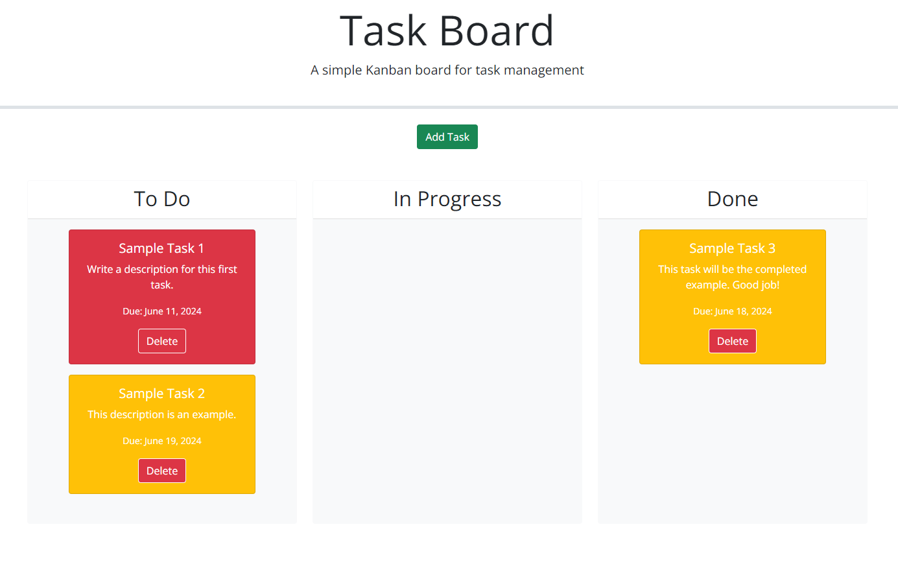

# Task-Board
This app is a project management task board.

## Description

This app utilizes third-party APIs to create a task board. In this task board, the user can input information into a modal to create a task card containing a task, a due date, and a task description. Once that data is inputed, a task card with those inputs populates the "To Do" lane on the board. Then, the user can drag and drop the task cards in the appropriate lanes as they progress through those tasks. Day.js helps the user keep track of due dates by updating the task card based on proximity to that deadline.

The purpose of this project was to utilize third-party API tools such as JQuery and Bootstrap from Module 5 to power my javascript code. I worked heavily with JSON as well as event handling, event delegation, dom traversal and more.

## Usage

In order to access the deployed website, click the following link: [https://nearias3.github.io/Task-Board/]

 
 

## Credits

Useful information about coding, including tutorials and guides, were provided by the UT Bootcamp GitLab: [https://git.bootcampcontent.com/University-of-Texas-at-Austin/UTA-VIRT-FSF-PT-05-2024-U-LOLC/].

I frequently referred to Mozilla's developer tool blogs (MDN Web Docs) for help identifying the correct code and syntax: [https://developer.mozilla.org/en].

I utilized helpful tips and code from the following sites:
[https://day.js.org/]
[https://jquery.com/]
[https://jqueryui.com/]
[https://getbootstrap.com/]

## License

Please refer to the license in the repo.